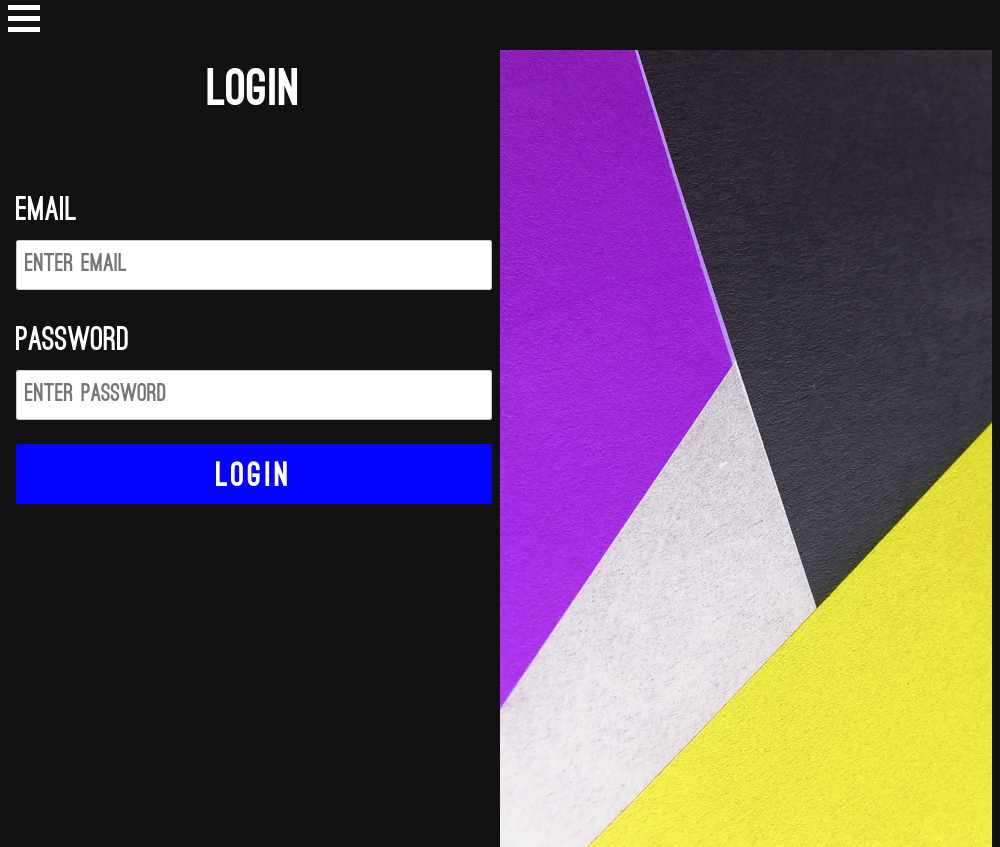
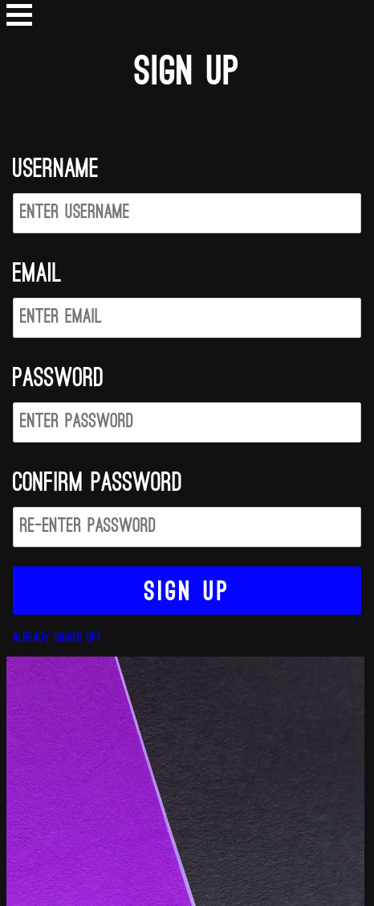

# Film Database

# An film database built with Nodejs, Express, and Sqlite3.





Clone project.
```
git clone https://github.com/brandon-wallace/film_database.git
```

Change into film_database directory.
```
$ cd film_database/
```

Install libraries.
```
$ npm install
```

Create a .env file and add SESSION_SECRET variable set to a random string.
```
$ touch .env

SESSION_SECRET=abcdefg-hijklm-nopqrs-tuvwxyz
```

Start nodemon development server.
```
$ npm start dev
```

Using a browser navigate to the address 127.0.0.1:3000.
```
http://127.0.0.1:3000

```

Photo by [Anni Roenkae](https://www.pexels.com/@anniroenkae) from Pexels.
